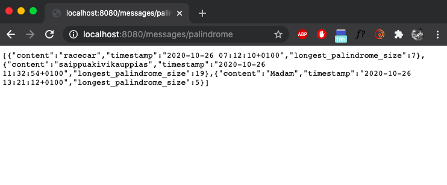
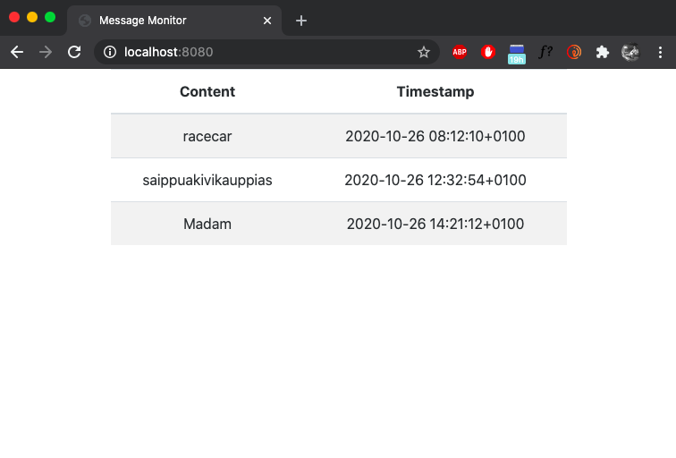

README
======

[Requirements](Requirements.md)

## Table of Contents

- [Description](#description)
- [Prerequisites](#prerequisites)
- [Start the app](#start-the-app)
- [Endpoints](#endpoints)

## Description

A simple webapp to check content for palindromes

## Prerequisites

* JDK 11 or later
* Maven 4.0 or later
* Docker
* Installed version of Postgres to test locally

## Start the app

To build the project, use
```bash
  $ docker-compose build
  $ ./mvnw clean package
```

To run the tests, use
```bash
  $ ./mvnw test
```

To run the project, use
```bash
  $ docker-compose up
```

## Endpoints

* ### Create message
```http
  POST /messages
```
| Parameter | Type | Description |
| :---: | :---: | :---: |
| `content` | `string` | **Required** <br> Your message, will be checked for palindromes |
| `timestamp` | `string` | **Required** <br> A timestamp, format should be: <br> yyyy-MM-dd HH:mm:ssZ |

Messages persisted in a PostgreSQL database.
Please be aware of the timezone configuration of your database.

#### Example
```json
{
  "content": "abrakadabra",
  "timestamp": "2018-10-09 00:12:12+0100"
}
```

* ### Read messages, enriched with palindrome count
```http
  GET /messages/palindrome
```
| Parameter | Type | Description |
| :---: | :---: | :---: |
| `content` | `string` | The original message |
| `timestamp` | `string` | The timestamp, format will be: <br> yyyy-MM-dd HH:mm:ssZ |
| `longest_palindrome_size` | `number` | Size of the longest palindrome in the message |

#### Response

```json
[
  {   
    "content": "abrakadabra",
    "timestamp": "2018-10-08 23:12:12+0000",
    "longest_palindrome_size": 3
  }
]
```
When computing palindromes only alphabetic characters considered, 
everything else ignored, case-insensitive

* ### Monitor messages sent to the server
```http
  GET /
``` 


Broadcaster through the STOMP websocket:
```http
  /topic/messages
```


